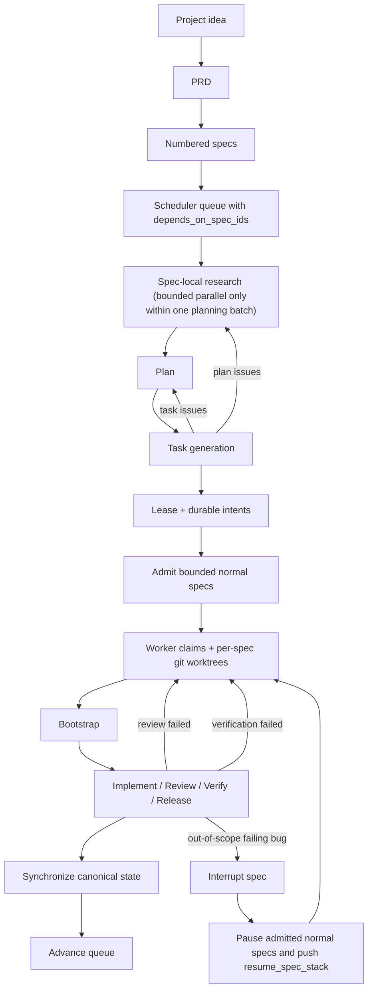

# Ralph Harness

Ralph turns a coding agent into a repo-resident engineering loop with durable state, explicit planning, structured handoffs, and resumable execution.

If you want an LLM to keep working from files instead of chat memory, this project is built for that.

As of `v0.11.1`, Ralph is a dependency-aware multi-spec scheduler, not a single active-spec queue. It can admit a bounded window of ready specs, isolate each admitted spec in its own git worktree, require a canonical bootstrap step before implementation begins, auto-continue safe stop boundaries through repo-local hooks in Codex, Claude Code, and Cursor, accept new user requests through a durable intent inbox while work is already running, coordinate concurrent threads through a short-lived single-writer lease, let different supported runtimes claim different admitted spec slots through a shared worker-claims file, and keep advancing all runnable specs instead of stopping after the first completed spec.

## Why People Use Ralph

Ralph is for teams and solo builders who want:

- long-running LLM work that survives restarts and context loss
- project work to move through PRD, spec, plan, task, review, verify, and release stages
- bounded concurrent spec execution instead of uncontrolled execution swarms
- a harness that can be installed into real repositories and upgraded safely later

What you get:

- thin loader blocks in `AGENTS.md` and `CLAUDE.md` that point every supported agent at the same Ralph truth
- a project constitution and runtime contract under `.ralph/`
- a preserved runtime-override surface for project-specific rules without forking the base contract
- role and adapter packs in `.codex/`, `.claude/`, `.cursor/`, and `.agents/skills/`
- canonical workflow and queue state on disk
- numbered specs, plans, tasks, reports, and logs that survive restarts
- bounded parallel `research`, hard spec dependencies, durable intent intake, and per-spec worktree execution
- bootstrap-gated implementation, spec-scoped worker reports, conservative stop-boundary auto-continuation hooks, upgrade-safe state migration, and lease-aware cross-thread coordination

## Human Installation Instructions

Keep this simple.

Tell your LLM:

```text
Set up my project with Ralph using this repository:
https://github.com/tolulawson/ralph-harness

Install the required Ralph components into this project and prepare it for use.
```

If you want to be a little more explicit, say:

```text
Set up my project with Ralph using this repository:
https://github.com/tolulawson/ralph-harness

Install Ralph into this project, keep my existing project files, and prepare the project so I can use Ralph right away.
```

For the full installation contract, read [INSTALLATION.md](https://github.com/tolulawson/ralph-harness/blob/main/INSTALLATION.md).

## Skills Section

Ralph exposes a small public entry surface under `skills/`. These are the main ways end users interact with the repository:

- `ralph-install` installs the harness into a repository that does not have it yet
- `ralph-upgrade` refreshes an existing install without clobbering project-owned runtime data
- `ralph-prd` creates the project PRD
- `ralph-plan` turns requirements into numbered specs, plans, and tasks
- `ralph-execute` resumes the harness from disk and advances the queue
- `ralph-interrupt` splits a failing out-of-scope bug into an interrupt spec

Example prompts:

1. Creating a PRD

```text
Use ralph-prd to create a PRD for a customer support inbox that prioritizes urgent tickets, tracks SLAs, and supports internal notes.
```

2. Executing QA

```text
Use ralph-execute to resume the installed Ralph harness, run the next verification or QA-related step from disk, and tell me what passed, failed, or is blocked.
```

3. Planning

```text
Use ralph-plan to turn the existing PRD into numbered specs, planning artifacts, and dependency-ordered tasks without starting implementation.
```

These prompts are intentionally plain. Ralph is meant to be easy to point at real work quickly.

## Simple Installation Instructions

If you just want the shortest path:

1. Send your LLM this repo URL:
   `https://github.com/tolulawson/ralph-harness`
2. Tell it:

```text
Set up my project with Ralph using this repository and prepare it for use.
```

Step-by-step usage after install:

1. Use `ralph-prd` if the project still needs a PRD.
2. Use `ralph-plan` once the requirements are clear and you want numbered specs plus tasks.
3. Use `ralph-execute` once the harness is installed and ready to resume from disk.
4. Use `ralph-interrupt` when a failing out-of-scope bug should become its own interrupt spec.
5. Use `ralph-upgrade` when you want a newer scaffold release.

## Installation And Upgrade

Read the full guides:

- [INSTALLATION.md](https://github.com/tolulawson/ralph-harness/blob/main/INSTALLATION.md)
- [UPGRADING.md](https://github.com/tolulawson/ralph-harness/blob/main/UPGRADING.md)
- [CHANGELOG.md](https://github.com/tolulawson/ralph-harness/blob/main/CHANGELOG.md)

The short version:

- install or upgrade from tagged releases, not arbitrary root snapshots
- use `v0.11.1` as the default public reference right now
- copy only manifest-listed scaffold paths from `src/`
- let the target repo generate and own its runtime records
- during upgrade, merge `.codex/config.toml` plus repo-local hook configs instead of overwriting user-owned settings like `sandbox_mode`
- preserve unknown runtime skills under `.agents/skills/` while Ralph refreshes only its managed runtime skill set
- install and upgrade all supported runtime adapter packs together rather than selecting one agent up front
- do not upgrade over a healthy live orchestrator lease
- persist the canonical project base branch in `.ralph/context/project-facts.json`
- expect legacy installs to migrate into spec-scoped worker reports and per-spec worktree metadata

## For LLMs

When an LLM installs or upgrades Ralph, the important rules are:

- use `src/` as the installable scaffold source
- never copy the repo-root dogfood runtime into target repositories
- use `src/install-manifest.txt` for fresh installs
- use `src/upgrade-manifest.txt` for upgrades
- treat `skills/` as the public entry surface
- preserve user-owned config in installed `.codex/config.toml` during upgrade while still applying Ralph-managed entries
- install or refresh `AGENTS.md`, `CLAUDE.md`, `.codex/`, `.claude/`, and `.cursor/` together so any supported runtime can pick up the repo without a separate install step

The source-of-truth split in this repository is:

- `src/` is the scaffold shipped to other repos
- repo root is this repository's live dogfood runtime
- `skills/` is the public invocation surface for install, upgrade, and resume flows

## Architectural Overview

Ralph keeps shared state behind a single-writer lease, but lease ownership is brief and operation-scoped rather than tied to one immortal orchestrator thread. Normal specs enter a FIFO admission window, hard dependencies gate admission, and each admitted spec runs in its own git worktree while the canonical checkout owns queue state, projections, logs, and reconciliation. The only unconstrained fan-out remains forbidden: `research` is still bounded to specs produced or refreshed in the same planning batch, and non-research roles stay at one worker per admitted spec. Supported runtimes may use native subagents when available, but correctness comes from the lease plus worker-claims contract, not from any one tool's delegation primitive.



In practice, that means:

- specs are the durable execution unit
- `depends_on_spec_ids` are hard admission blockers
- `task-state.json` is the canonical task lifecycle record
- the orchestrator chooses the queue head, admitted spec window, and next task
- `.ralph/state/orchestrator-lease.json` elects a temporary single-writer leader
- `.ralph/state/worker-claims.json` lets Codex, Claude, or Cursor claim different admitted slots safely
- `.ralph/state/orchestrator-intents.jsonl` records cross-thread requests durably
- admitted specs run in dedicated git worktrees under `.ralph/worktrees/`
- `bootstrap` is the required first execution boundary before implementation or any other execution role begins in a claim
- worker reports live at `.ralph/reports/<run-id>/<spec-key>/<role>.md`, while the orchestrator report stays at `.ralph/reports/<run-id>/orchestrator.md`
- project-specific runtime additions belong in `.ralph/policy/runtime-overrides.md`, while `.ralph/runtime-contract.md` stays scaffold-owned
- supported runtimes may use native subagents, but a plain runtime session may also execute a claimed slot directly
- bootstrap, implementation, review, verification, and release run at most one worker per admitted spec
- all role configs run with `sandbox_mode = "danger-full-access"`
- if an out-of-scope failing bug appears, Ralph can spin out an interrupt spec, push the paused work onto `resume_spec_stack`, and resume it later
- `plan-check` can route work back to `plan` or `task-gen`
- `review_failed` and `verification_failed` are canonical look-back states that send work back through implementation

## Operational Model

Ralph now separates three concerns that used to get conflated in lighter-weight queue runners:

- scheduling:
  the queue tracks `active_spec_ids`, `active_interrupt_spec_id`, `depends_on_spec_ids`, admission state, and per-spec worktree metadata
- coordination:
  `.ralph/state/orchestrator-lease.json` prevents multiple threads from mutating shared state at the same time, while `.ralph/state/orchestrator-intents.jsonl` lets new work requests land durably even when another orchestrator run is active
- execution:
  every admitted spec gets one branch, one worktree, one active non-research worker at a time, must pass `bootstrap` before execution begins locally, and owns its own report path

That means you can ask Ralph to start another spec while other work is already in progress, but the scheduler still decides when that spec becomes admissible. Hard dependencies are not bypassed, and later specs do not jump ahead of earlier eligible ones.

## Upgrade Safety

Upgrade behavior is part of the runtime model now, not an afterthought. In `v0.11.1`, the shipped upgrade path:

- blocks upgrades over a healthy live orchestrator lease
- runs a preflight check that blocks upgrade when `.ralph/runtime-contract.md` was edited directly
- recovers stale held leases back to `idle`
- normalizes safely-derivable legacy worktree assignments into unique per-spec worktrees
- normalizes legacy worker report pointers into spec-scoped report paths when ownership is clear
- fails loudly instead of guessing when branch ownership, worktree ownership, task lifecycle, or legacy report ownership is ambiguous

For project-specific runtime rules, Ralph treats `.ralph/policy/runtime-overrides.md` as the preserved extension surface. The base `.ralph/runtime-contract.md` remains upgrade-managed, and direct edits there are treated as scaffold drift.

An installed Ralph repo gets:

- `.ralph/constitution.md`
- `.ralph/runtime-contract.md`
- `.ralph/policy/project-policy.md`
- `AGENTS.md`
- `CLAUDE.md`
- `.codex/config.toml`
- `.codex/agents/*.toml`
- `.claude/agents/*.md`
- `.claude/commands/*.md`
- `.cursor/rules/*.mdc`
- `.agents/skills/`
- `.ralph/state/workflow-state.json`
- `.ralph/state/spec-queue.json`
- `.ralph/templates/`
- `specs/INDEX.md`

Runtime records such as reports, logs, task state, and project-specific specs are then generated in the target repository.

## Repository Layout

For end users, the important directories are:

```text
skills/                      Public install, upgrade, and execution entry points
src/                         Installable scaffold source
src/install-manifest.txt     Fresh install contract
src/upgrade-manifest.txt     Upgrade-safe overwrite contract
src/generated-runtime-manifest.txt
                             Runtime records created after install
```

For contributors to the harness itself:

```text
src/.codex/                  Shipped Codex adapter pack
src/.claude/                 Shipped Claude Code adapter pack
src/.cursor/                 Shipped Cursor adapter pack
src/.agents/skills/          Shipped runtime role skills
src/.ralph/                  Shipped doctrine, policy, templates, and seed state

.codex/                      Dogfood control plane for this source repo
.agents/skills/              Dogfood runtime skills for this source repo
.ralph/                      Live dogfood runtime state, reports, logs, and templates
tasks/                       Dogfood PRDs and todo tracking
specs/                       Dogfood numbered specs and register
```

## This Repository Also Dogfoods Ralph

This repo is not just the source template. It is also a live Ralph-managed project.

That means:

- repo root contains real runtime history for this repository
- `src/` contains the clean scaffold that gets shipped elsewhere
- changes to the harness itself should usually be made in `src/` first

Current dogfood examples live in:

- [tasks/prd-ralph-harness.md](https://github.com/tolulawson/ralph-harness/blob/main/tasks/prd-ralph-harness.md)
- [specs/INDEX.md](https://github.com/tolulawson/ralph-harness/blob/main/specs/INDEX.md)
- [`.ralph/state/workflow-state.json`](https://github.com/tolulawson/ralph-harness/blob/main/.ralph/state/workflow-state.json)
- [`.ralph/state/spec-queue.json`](https://github.com/tolulawson/ralph-harness/blob/main/.ralph/state/spec-queue.json)

Those are reference records, not the files target repos should copy directly.

## Versioning

Ralph ships via semver tags. The human-facing release reference is a tag like `v0.11.1`, while installed repos also record the resolved commit for reproducibility in `.ralph/harness-version.json`.
