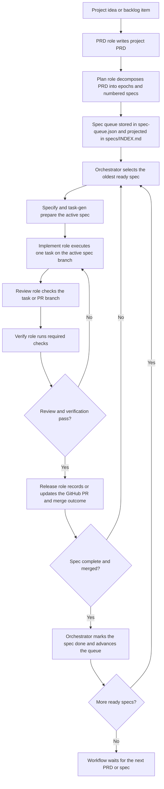

# Codex-Native Ralph Harness

This repository has three jobs at once:

- a **reference repo** that explains the Ralph loop
- a **source-template repo** that exposes an installable scaffold under `src/`
- a **live dogfood runtime** at the repo root that uses the harness on itself

The important separation is:

- `src/` is the canonical scaffold that gets installed into other projects
- repo root is the workshop and live Ralph-managed dogfood project for this repository
- `skills/` stays at repo root as the public entry surface for installing or invoking the harness

## Objective

Use this repository when you want Codex to install an orchestrated coding system into a target project rather than treat that project as a series of one-off chat sessions. The harness gives Codex:

- a thin Codex loader in `AGENTS.md`
- a durable harness doctrine in `.ralph/constitution.md`
- a durable control plane in `.codex/config.toml` and `agents/*.toml`
- a role-based runtime skill system in `.agents/skills/`
- a canonical runtime state in `.ralph/state/workflow-state.json`
- a canonical spec queue in `.ralph/state/spec-queue.json`
- a human-readable queue projection in `specs/INDEX.md`
- an append-only audit trail in `.ralph/logs/events.jsonl`
- standardized handoff reports in `.ralph/reports/<run-id>/`
- repeatable planning and execution artifacts in `tasks/` and `specs/<spec-id>-<slug>/`

Target repositories should install the scaffold from `src/`, then generate and maintain their own live runtime data locally.

## How The Harness Works

The parent Codex agent is the orchestrator. It reads the constitution, project policy, runtime state, spec queue, latest report, active spec files, and a short tail of recent events. It then decides which role should act next and invokes one focused sub-agent.



Each spec is the execution unit. The orchestrator:

- selects the next ready spec in FIFO order
- selects the next task inside that spec
- ensures the active branch and active PR match the spec
- routes work through implement, review, verify, and release
- advances the queue only when the spec is done

## Repository Layout

```text
skills/                           Public source skills
src/                              Canonical installable scaffold
src/install-manifest.txt          Install contract for target repos
src/generated-runtime-manifest.txt Runtime files created after install
src/AGENTS.md                     Scaffold loader copied into target repos
src/.codex/                       Scaffold role declarations
src/agents/                       Scaffold role configs
src/.agents/skills/               Scaffold runtime role skills
src/.ralph/                       Scaffold doctrine, policy, templates, neutral seed state
src/specs/INDEX.md                Neutral seed spec register

AGENTS.md                         Root dogfood loader
.codex/                           Root dogfood role declarations
agents/                           Root dogfood role configs
.agents/skills/                   Root dogfood runtime role skills
.ralph/                           Root dogfood runtime state, reports, logs, templates
tasks/                            Root dogfood PRDs, todo tracker, lessons
specs/                            Root dogfood numbered specs and register
README.md                         Repository overview
INSTALLATION.md                   Installation guide
```

## Source Template Vs Dogfood Runtime

The repository intentionally keeps these layers separate:

- `src/` is the installable scaffold source of truth
- repo root is the live dogfood runtime for this repository
- `skills/` is the public invocation surface used to install or invoke the harness

That means:

- `src/` contains installable scaffold files, templates, and neutral seed state
- `src/` does not carry this repository's TODOs, lessons, event history, or bootstrap work records
- repo root contains this repository’s real event log, real reports, real numbered spec history, and real queue state
- target repos should never receive the root dogfood history
- target runtime records such as `tasks/todo.md`, `tasks/lessons.md`, and `.ralph/logs/events.jsonl` are generated after the scaffold is copied

When improving the harness itself in this repository:

- edit scaffold behavior in `src/` first
- keep root runtime records separate from shipped scaffold output
- apply root updates only when the task explicitly requests changes to the dogfood runtime or source-repo documents

## External Entry Points

This repository exposes a small public skill surface under `skills/`:

- `ralph-install`
- `ralph-prd`
- `ralph-plan`
- `ralph-execute`

Canonical GitHub source for third-party installation:

- `tolulawson/ralph-harness`
- `skills/ralph-install`
- `skills/ralph-prd`
- `skills/ralph-plan`
- `skills/ralph-execute`

Use them like this:

- use `ralph-install` from a target repository when the harness is not installed yet
- use `ralph-prd` when you want to create the project PRD and epoch framing directly
- use `ralph-plan` when you want to seed the numbered spec queue and planning artifacts directly
- use `ralph-execute` from a target repository when the harness is already installed and you want an explicit named resume entry point

These are distinct from the runtime role skills under `.agents/skills/`.

## Installation

Read [INSTALLATION.md](/Users/tolu/Desktop/dev/ralph-harness/INSTALLATION.md) for the full setup procedure.

In short:

- install the public `ralph-*` skills via a third-party skill installer when you want explicit named entry points
- treat `src/` as the only installable scaffold source
- copy only the manifest-listed scaffold paths from `src/install-manifest.txt`
- generate the runtime files listed in `src/generated-runtime-manifest.txt`
- keep the repo root runtime history out of target projects
- reset the workflow state and spec queue for the target project
- create the initial project PRD, epoch map, numbered specs, and tasks

## Dogfood Runtime

The repo root remains a live Ralph-managed project. Its current runtime artifacts are examples of the harness working on itself:

- [tasks/prd-ralph-harness.md](/Users/tolu/Desktop/dev/ralph-harness/tasks/prd-ralph-harness.md)
- [specs/INDEX.md](/Users/tolu/Desktop/dev/ralph-harness/specs/INDEX.md)
- [specs/001-self-bootstrap-harness/spec.md](/Users/tolu/Desktop/dev/ralph-harness/specs/001-self-bootstrap-harness/spec.md)
- [`.ralph/state/workflow-state.json`](/Users/tolu/Desktop/dev/ralph-harness/.ralph/state/workflow-state.json)
- [`.ralph/state/spec-queue.json`](/Users/tolu/Desktop/dev/ralph-harness/.ralph/state/spec-queue.json)

Those files are reference dogfood records, not the installable template content.
