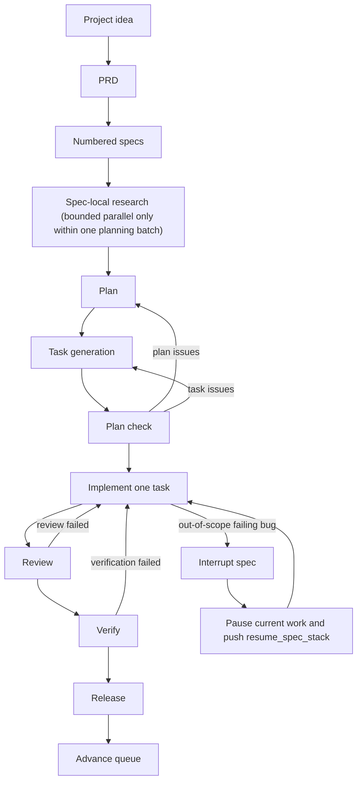

# Ralph Harness

Ralph turns Codex from a one-shot coding assistant into a repo-resident engineering loop with durable state, explicit planning, structured handoffs, and resumable execution.

If you want an LLM to keep working from files instead of chat memory, this project is built for that.

## Why People Use Ralph

Ralph is for teams and solo builders who want:

- long-running LLM work that survives restarts and context loss
- project work to move through PRD, spec, plan, task, review, verify, and release stages
- one active implementation task at a time instead of uncontrolled execution swarms
- a harness that can be installed into real repositories and upgraded safely later

What you get:

- a thin loader in `AGENTS.md` that tells Codex where truth lives
- a project constitution and runtime contract under `.ralph/`
- a role-based control plane in `.codex/` and `.agents/skills/`
- canonical workflow and queue state on disk
- numbered specs, plans, tasks, reports, and logs that survive restarts
- bounded parallel `research` during planning, with sequential execution afterward

## Human Installation Instructions

Keep this simple.

Tell your LLM:

```text
Set up my project with Ralph using this repository:
https://github.com/tolulawson/ralph-harness

Install the required Ralph components into this project and prepare it for use.
```

If you want to be a little more explicit, say:

```text
Set up my project with Ralph using this repository:
https://github.com/tolulawson/ralph-harness

Install Ralph into this project, keep my existing project files, and prepare the project so I can use Ralph right away.
```

For the full installation contract, read [INSTALLATION.md](https://github.com/tolulawson/ralph-harness/blob/main/INSTALLATION.md).

## Skills Section

Ralph exposes a small public entry surface under `skills/`. These are the main ways end users interact with the repository:

- `ralph-install` installs the harness into a repository that does not have it yet
- `ralph-upgrade` refreshes an existing install without clobbering project-owned runtime data
- `ralph-prd` creates the project PRD
- `ralph-plan` turns requirements into numbered specs, plans, and tasks
- `ralph-execute` resumes the harness from disk and advances the queue
- `ralph-interrupt` splits a failing out-of-scope bug into an interrupt spec

Example prompts:

1. Creating a PRD

```text
Use ralph-prd to create a PRD for a customer support inbox that prioritizes urgent tickets, tracks SLAs, and supports internal notes.
```

2. Executing QA

```text
Use ralph-execute to resume the installed Ralph harness, run the next verification or QA-related step from disk, and tell me what passed, failed, or is blocked.
```

3. Planning

```text
Use ralph-plan to turn the existing PRD into numbered specs, planning artifacts, and dependency-ordered tasks without starting implementation.
```

These prompts are intentionally plain. Ralph is meant to be easy to point at real work quickly.

## Simple Installation Instructions

If you just want the shortest path:

1. Send your LLM this repo URL:
   `https://github.com/tolulawson/ralph-harness`
2. Tell it:

```text
Set up my project with Ralph using this repository and prepare it for use.
```

Step-by-step usage after install:

1. Use `ralph-prd` if the project still needs a PRD.
2. Use `ralph-plan` once the requirements are clear and you want numbered specs plus tasks.
3. Use `ralph-execute` once the harness is installed and ready to resume from disk.
4. Use `ralph-interrupt` when a failing out-of-scope bug should become its own interrupt spec.
5. Use `ralph-upgrade` when you want a newer scaffold release.

## Installation And Upgrade

Read the full guides:

- [INSTALLATION.md](https://github.com/tolulawson/ralph-harness/blob/main/INSTALLATION.md)
- [UPGRADING.md](https://github.com/tolulawson/ralph-harness/blob/main/UPGRADING.md)
- [CHANGELOG.md](https://github.com/tolulawson/ralph-harness/blob/main/CHANGELOG.md)

The short version:

- install or upgrade from tagged releases, not arbitrary root snapshots
- use `v0.6.1` as the default public reference right now
- copy only manifest-listed scaffold paths from `src/`
- let the target repo generate and own its runtime records
- during upgrade, merge `.codex/config.toml` instead of overwriting user-owned settings like `sandbox_mode`

## For LLMs

When Codex or another LLM installs or upgrades Ralph, the important rules are:

- use `src/` as the installable scaffold source
- never copy the repo-root dogfood runtime into target repositories
- use `src/install-manifest.txt` for fresh installs
- use `src/upgrade-manifest.txt` for upgrades
- treat `skills/` as the public entry surface
- preserve user-owned config in installed `.codex/config.toml` during upgrade while still applying Ralph-managed entries

The source-of-truth split in this repository is:

- `src/` is the scaffold shipped to other repos
- repo root is this repository's live dogfood runtime
- `skills/` is the public invocation surface for install, upgrade, and resume flows

## Architectural Overview

Ralph keeps the orchestrator in charge of shared state. Normal execution stays sequential. The only bounded parallelism is spec-local `research` for specs produced or refreshed in the same planning batch.



In practice, that means:

- specs are the durable execution unit
- `task-state.json` is the canonical task lifecycle record
- the orchestrator chooses the queue head and next task
- implementation, review, verification, and release run one worker at a time
- if an out-of-scope failing bug appears, Ralph can spin out an interrupt spec, push the paused work onto `resume_spec_stack`, and resume it later
- `plan-check` can route work back to `plan` or `task-gen`
- `review_failed` and `verification_failed` are canonical look-back states that send work back through implementation

An installed Ralph repo gets:

- `.ralph/constitution.md`
- `.ralph/runtime-contract.md`
- `.ralph/policy/project-policy.md`
- `.codex/config.toml`
- `.codex/agents/*.toml`
- `.agents/skills/`
- `.ralph/state/workflow-state.json`
- `.ralph/state/spec-queue.json`
- `.ralph/templates/`
- `specs/INDEX.md`

Runtime records such as reports, logs, task state, and project-specific specs are then generated in the target repository.

## Repository Layout

For end users, the important directories are:

```text
skills/                      Public install, upgrade, and execution entry points
src/                         Installable scaffold source
src/install-manifest.txt     Fresh install contract
src/upgrade-manifest.txt     Upgrade-safe overwrite contract
src/generated-runtime-manifest.txt
                             Runtime records created after install
```

For contributors to the harness itself:

```text
src/.codex/                  Shipped control plane
src/.agents/skills/          Shipped runtime role skills
src/.ralph/                  Shipped doctrine, policy, templates, and seed state

.codex/                      Dogfood control plane for this source repo
.agents/skills/              Dogfood runtime skills for this source repo
.ralph/                      Live dogfood runtime state, reports, logs, and templates
tasks/                       Dogfood PRDs and todo tracking
specs/                       Dogfood numbered specs and register
```

## This Repository Also Dogfoods Ralph

This repo is not just the source template. It is also a live Ralph-managed project.

That means:

- repo root contains real runtime history for this repository
- `src/` contains the clean scaffold that gets shipped elsewhere
- changes to the harness itself should usually be made in `src/` first

Current dogfood examples live in:

- [tasks/prd-ralph-harness.md](https://github.com/tolulawson/ralph-harness/blob/main/tasks/prd-ralph-harness.md)
- [specs/INDEX.md](https://github.com/tolulawson/ralph-harness/blob/main/specs/INDEX.md)
- [`.ralph/state/workflow-state.json`](https://github.com/tolulawson/ralph-harness/blob/main/.ralph/state/workflow-state.json)
- [`.ralph/state/spec-queue.json`](https://github.com/tolulawson/ralph-harness/blob/main/.ralph/state/spec-queue.json)

Those are reference records, not the files target repos should copy directly.

## Versioning

Ralph ships via semver tags. The human-facing release reference is a tag like `v0.6.1`, while installed repos also record the resolved commit for reproducibility in `.ralph/harness-version.json`.
