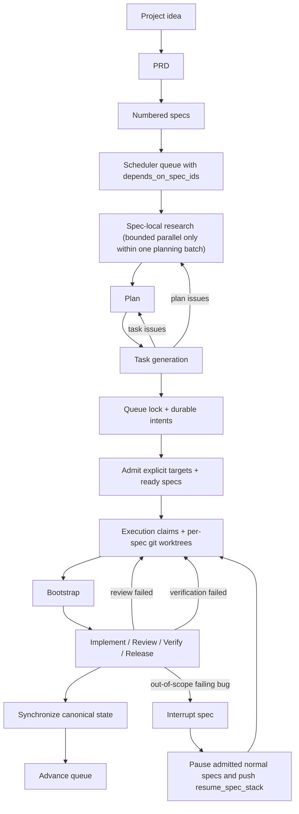

# Ralph Harness

Ralph turns a coding agent into a repo-resident engineering loop with durable state, explicit planning, structured handoffs, and resumable execution.

If you want an LLM to keep working from files instead of chat memory, this project is built for that.

Ralph is a dependency-aware multi-spec scheduler, not a one-spec-at-a-time chat loop. It admits an explicit-first ready set of dependency-satisfied specs, isolates admitted work in per-spec git worktrees, requires a canonical bootstrap step before execution roles begin, accepts new user requests through a durable intent inbox while work is already running, coordinates concurrent threads through a short-lived shared queue lock, lets multiple orchestrator peers cooperate against the same control plane, and keeps advancing runnable work instead of stopping after the first successful handoff.

## Why People Use Ralph

Ralph is for teams and solo builders who want:

- long-running LLM work that survives restarts and context loss
- project work to move through PRD, spec, plan, task, review, verify, and release stages
- bounded concurrent spec execution instead of uncontrolled execution swarms
- a harness that can be installed into real repositories and upgraded safely later

What you get:

- thin loader blocks in `AGENTS.md` and `CLAUDE.md` that point every supported agent at the same Ralph truth
- a project constitution and runtime contract under `.ralph/`
- a preserved runtime-override surface for project-specific rules without forking the base contract
- role and adapter packs in `.codex/`, `.claude/`, `.cursor/`, and `.agents/skills/`
- a canonical shared control plane on disk under `.ralph/state/`, `.ralph/logs/`, `.ralph/reports/`, `.ralph/context/`, `.ralph/policy/`, `.ralph/constitution.md`, `.ralph/runtime-contract.md`, and `specs/INDEX.md`
- numbered specs, plans, tasks, reports, and logs that survive restarts
- bounded parallel `research`, explicit-first ready-set admission, hard spec dependencies, durable intent intake, per-spec worktree execution, and generated `.ralph/shared/` overlays for admitted worktrees
- bootstrap-gated implementation, spec-scoped worker reports, conservative stop-boundary auto-continuation hooks, upgrade-safe state migration, and queue-lock-aware cross-thread coordination

## Installation

The quickest way to install Ralph is to point your LLM at this repository:

```text
Set up my project with Ralph using https://github.com/tolulawson/ralph-harness. Install Ralph into this project, keep my existing project files, and prepare the project so I can use Ralph right away.
```

If you want to install Ralph manually instead, follow [INSTALLATION.md](https://github.com/tolulawson/ralph-harness/blob/main/INSTALLATION.md).

In short, manual install means:

1. Copy the scaffold from `src/` using the paths listed in `src/install-manifest.txt`.
2. Generate the runtime-owned files listed in `src/generated-runtime-manifest.txt`.
3. Preserve your project files and let the target repository own its runtime state after install.
4. Use `skills/`, `AGENTS.md`, and `CLAUDE.md` as the public entry surface once setup is complete.
5. During install, ask whether the current checkout is the canonical control plane (or a custom path/branch should be used) and whether control-plane artifacts should be tracked or gitignored.

## Skills Section

Ralph exposes a small public entry surface under `skills/`. These are the main ways end users interact with the repository:

- `ralph-install` installs the harness into a repository that does not have it yet
- `ralph-upgrade` refreshes an existing install without clobbering project-owned runtime data
- `ralph-prd` creates the project PRD
- `ralph-plan` launches a dedicated planning coordinator subagent that turns requirements into numbered specs, synchronized planning artifacts, task registries, and a plan-check handoff
- `ralph-execute` resumes the harness from disk and advances the queue
- `ralph-interrupt` splits a failing out-of-scope bug into an interrupt spec

Example prompts:

1. Creating a PRD

```text
Use ralph-prd to create a PRD for a customer support inbox that prioritizes urgent tickets, tracks SLAs, and supports internal notes.
```

2. Executing QA

```text
Use ralph-execute to resume the installed Ralph harness, run the next verification or QA-related step from disk, and tell me what passed, failed, or is blocked.
```

3. Planning

```text
Use ralph-plan to turn the existing PRD into numbered specs, synchronized planning artifacts, dependency-ordered tasks, and task-state registries without starting implementation.
```

These prompts are intentionally plain. Ralph is meant to be easy to point at real work quickly.

`ralph-execute` preflight should self-heal derived projections and safely derivable admitted worktrees, route incomplete task registries back through planning or `task-gen`, and reserve `ralph-upgrade` for actual scaffold drift or mixed-version runtime state.

Step-by-step usage after install:

1. Use `ralph-prd` if the project still needs a PRD.
2. Use `ralph-plan` once the requirements are clear and you want numbered specs plus execution-ready task registries.
3. Use `ralph-execute` once the harness is installed and ready to resume from disk.
4. Use `ralph-interrupt` when a failing out-of-scope bug should become its own interrupt spec.
5. Use `ralph-upgrade` when you want a newer scaffold release.

## Installation And Upgrade

Read the full guides:

- [INSTALLATION.md](https://github.com/tolulawson/ralph-harness/blob/main/INSTALLATION.md)
- [UPGRADING.md](https://github.com/tolulawson/ralph-harness/blob/main/UPGRADING.md)
- [CHANGELOG.md](https://github.com/tolulawson/ralph-harness/blob/main/CHANGELOG.md)

The short version:

- install or upgrade from tagged releases, not arbitrary root snapshots
- use the latest stable tag unless you intentionally want to pin an older release
- copy only manifest-listed scaffold paths from `src/`
- let the target repo generate and own its runtime records
- keep the canonical shared control plane in the selected canonical checkout (current checkout by default) and use generated `.ralph/shared/` overlays inside admitted spec worktrees
- during upgrade, merge `.codex/config.toml` plus repo-local hook configs instead of overwriting user-owned settings like `sandbox_mode`
- preserve unknown runtime skills under `.agents/skills/` while Ralph refreshes only its managed runtime skill set
- keep project-specific control-plane tweaks out of Ralph-managed `.agents/skills/` directories; use `.ralph/policy/runtime-overrides.md`, `.ralph/policy/project-policy.md`, or a non-managed local skill directory instead
- install and upgrade all supported runtime adapter packs together rather than selecting one agent up front
- do not upgrade over a healthy held scheduler lock
- persist the canonical project base branch in `.ralph/context/project-facts.json`
- expect legacy installs to migrate into spec-scoped worker reports and per-spec worktree metadata

## For LLMs

When an LLM installs or upgrades Ralph, the important rules are:

- use `src/` as the installable scaffold source
- never install from the repository root or copy repo-root source-repo files into target repositories
- use `src/install-manifest.txt` for fresh installs
- use `src/upgrade-manifest.txt` for upgrades
- treat `skills/` as the public entry surface
- keep the canonical shared control plane in the canonical checkout and generate `.ralph/shared/` overlays when Ralph creates or refreshes admitted spec worktrees
- do not rely on tracked shared-control-plane copies inside a spec worktree when the canonical checkout or `.ralph/shared/` overlay is available
- preserve user-owned config in installed `.codex/config.toml` during upgrade while still applying Ralph-managed entries
- install or refresh `AGENTS.md`, `CLAUDE.md`, `.codex/`, `.claude/`, and `.cursor/` together so any supported runtime can pick up the repo without a separate install step

The source-of-truth split in this repository is:

- `src/` is the scaffold shipped to other repos
- repo root is the source-repo workspace for docs, release tooling, validation, and public source-entry skills
- `skills/` is the public invocation surface for install, upgrade, and resume flows

## Architectural Overview

Ralph keeps shared state behind a short-lived queue write lock rather than a resident scheduler owner. Public Ralph entrypoints are thin launchers: `ralph-execute` should immediately hand off to one dedicated orchestrator peer subagent, while `ralph-prd` and `ralph-plan` should immediately hand off to dedicated role subagents and must never keep PRD or planning coordination on the main thread. Queue-wide control-plane coordination belongs only to orchestrator peers while they briefly hold the scheduler lock. Normal specs enter an explicit-first ready-set admission window, hard dependencies gate admission, and each admitted spec runs in its own git worktree while the canonical checkout owns the canonical shared control plane: `.ralph/state/`, `.ralph/logs/`, `.ralph/reports/`, `.ralph/context/`, `.ralph/policy/`, `.ralph/constitution.md`, `.ralph/runtime-contract.md`, and `specs/INDEX.md`. Admitted worktrees expose those shared artifacts through generated `.ralph/shared/` overlays, and tracked shared-state copies inside a worktree are checkout artifacts only, not authoritative runtime state. Multiple orchestrator peers may participate in the same control plane, but only one may mutate queue-wide state at a time, and actual work ownership is carried by execution claims on admitted specs. The only unconstrained fan-out remains forbidden: `research` is still bounded to specs produced or refreshed in the same planning batch, and non-research roles stay at one worker per admitted spec.



In practice, that means:

- specs are the durable execution unit
- `depends_on_spec_ids` are hard admission blockers and should be used only for true execution prerequisites, not semantic relatedness or planning order
- `task-state.json` is the canonical task lifecycle record
- `active_spec_ids` is the authoritative active-spec set
- explicit user-requested specs outrank creation order when they are unblocked
- remaining ready specs are admitted by fairness order: `last_dispatch_at`, then `created_at`, then `spec_id`
- `.ralph/state/scheduler-lock.json` is a short-lived queue mutation lock
- `.ralph/state/execution-claims.json` lets Codex, Claude, or Cursor claim different admitted slots safely
- `.ralph/state/scheduler-intents.jsonl` records cross-thread requests durably
- `queue_revision` increments on every queue mutation so peers can detect fresh control-plane state
- admitted specs run in dedicated git worktrees under `.ralph/worktrees/`
- admitted spec worktrees get generated `.ralph/shared/` overlays back to the canonical shared control plane
- `bootstrap` is the required first execution boundary before implementation or any other execution role begins in a claim
- worker reports live at `.ralph/reports/<run-id>/<spec-key>/<role>.md`, while the orchestrator report stays at `.ralph/reports/<run-id>/orchestrator.md`
- project-specific runtime additions belong in `.ralph/policy/runtime-overrides.md`, while `.ralph/runtime-contract.md` stays scaffold-owned
- tracked shared-control-plane files that appear inside a spec worktree are not authoritative and must not be used as the source of truth when the canonical checkout or `.ralph/shared/` overlay is available
- Codex should use native worker subagents by default, while claim-holder execution remains a cross-runtime or non-native fallback
- bootstrap, implementation, review, verification, and release run at most one worker per admitted spec
- all role configs run with `sandbox_mode = "danger-full-access"`
- if an out-of-scope failing bug appears, Ralph can spin out an interrupt spec, push the paused work onto `resume_spec_stack`, and resume it later
- `plan-check` can route work back to `plan` or `task-gen`
- `review_failed` and `verification_failed` are canonical look-back states that send work back through implementation

## Operational Model

Ralph now separates three concerns that used to get conflated in lighter-weight queue runners:

- scheduling:
  the queue tracks `active_spec_ids`, `active_interrupt_spec_id`, `depends_on_spec_ids`, admission state, and per-spec worktree metadata
- coordination:
  `.ralph/state/scheduler-lock.json` prevents multiple threads from mutating shared state at the same time, while `.ralph/state/scheduler-intents.jsonl` lets new work requests land durably even when another orchestrator peer is active
- execution:
  any `ralph-execute` run may contribute one orchestrator peer, each peer schedules briefly under the queue lock, then releases it before worktree execution and claims at most one runnable role at a time through `.ralph/state/execution-claims.json`

That means you can ask Ralph to start another spec while other work is already in progress, and Ralph will honor that explicit target first if it is unblocked. Hard dependencies are not bypassed, and when no explicit target is waiting the scheduler falls back to deterministic fairness across the remaining ready set.

## Upgrade Safety

Upgrade behavior is part of the runtime model, not an afterthought. The shipped upgrade path:

- blocks upgrades over a healthy held scheduler lock
- runs a preflight check that blocks upgrade when `.ralph/runtime-contract.md` was edited directly
- recovers stale held scheduler locks back to `idle`
- removes legacy queue-head state instead of perpetuating it during migration
- normalizes safely-derivable legacy worktree assignments into unique per-spec worktrees
- regenerates `.ralph/shared/` overlays for admitted worktrees and validates canonical shared-state ownership
- normalizes legacy worker report pointers into spec-scoped report paths when ownership is clear
- fails loudly instead of guessing when branch ownership, worktree ownership, task lifecycle, or legacy report ownership is ambiguous

For project-specific runtime rules, Ralph treats `.ralph/policy/runtime-overrides.md` as the preserved extension surface. The base `.ralph/runtime-contract.md` remains upgrade-managed, and direct edits there are treated as scaffold drift.

Project-specific control-plane instructions should not be written into canonical scaffold-owned files (`.ralph/runtime-contract.md` or Ralph-managed runtime skill directories). Put those rules into `.ralph/policy/runtime-overrides.md`, `.ralph/policy/project-policy.md`, and `.ralph/context/project-facts.json` fields such as `canonical_control_plane` and `control_plane_versioning`.

An installed Ralph repo gets:

- `.ralph/constitution.md`
- `.ralph/runtime-contract.md`
- `.ralph/policy/project-policy.md`
- `AGENTS.md`
- `CLAUDE.md`
- `.codex/config.toml`
- `.codex/agents/*.toml`
- `.claude/agents/*.md`
- `.claude/commands/*.md`
- `.cursor/rules/*.mdc`
- `.agents/skills/`
- `.ralph/state/workflow-state.json`
- `.ralph/state/spec-queue.json`
- `.ralph/templates/`
- `specs/INDEX.md`

Runtime records such as reports, logs, task state, and project-specific specs are then generated in the target repository.

## Repository Layout

For end users, the important directories are:

```text
skills/                      Public install, upgrade, and execution entry points
src/                         Installable scaffold source
src/install-manifest.txt     Fresh install contract
src/upgrade-manifest.txt     Upgrade-safe overwrite contract
src/generated-runtime-manifest.txt
                             Runtime records created after install
```

For contributors to the harness itself:

```text
src/.codex/                  Shipped Codex adapter pack
src/.claude/                 Shipped Claude Code adapter pack
src/.cursor/                 Shipped Cursor adapter pack
src/.agents/skills/          Shipped runtime role skills
src/.ralph/                  Shipped doctrine, policy, templates, and seed state

skills/                      Public source-entry skills
scripts/                     Install, upgrade, migration, and validation tooling
AGENTS.md                    Source-repo contributor loader
CLAUDE.md                    Source-repo contributor loader
README.md                    Source-repo overview
INSTALLATION.md              Canonical install guide
UPGRADING.md                 Canonical upgrade guide
```

## Source Repo Workflow

This repo ships Ralph from `src/` rather than running an installed Ralph control plane at repo root.

That means:

- `src/` is the only installable scaffold source
- root files document, validate, package, and release that scaffold
- changes to the harness itself should usually be made in `src/` first, then reflected in docs and scripts at repo root

## Versioning

Ralph ships via semver tags. The human-facing release reference is a tag like `vX.Y.Z`, while installed repos also record the resolved commit for reproducibility in `.ralph/harness-version.json`.
